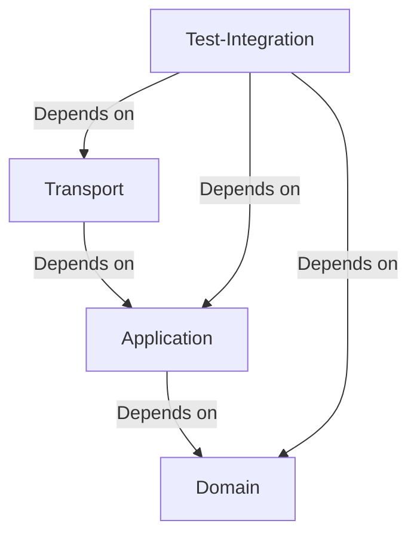

# Overengineered E-commerce catalog service

This project is a simple e-commerce catalog service that provides a REST API to manage products and categories.

## Prerequisites

- Java 21 or higher
- Maven
- Docker (for running the database)

## Setup

1. Clone the repository:
    ```sh
    git clone https://github.com/your-repo/overengineered-ecommerce.git
    cd overengineered-ecommerce
    ```

2. Start the required services using Docker:
    ```sh
    make up
    ```

## Project Structure

- `src/test/java/com/overengineeredecommerce/integrationtest`: Contains the integration tests, step definitions, and test context.
- `src/test/resources/features`: Contains the Cucumber feature files.
- `Makefile`: Contains commands.

## Running Tests

To run the integration tests, use the following command:
```sh
mvn clean install
```

## Configuration

The `CucumberIT` class is used to run the Cucumber tests and configure the Spring context. 
The `TestConfig` class scans for Spring components.
The `TestContext` class scans for Spring components.

## License

This project is licensed under the MIT License. See the `LICENSE` file for details.


## Modules Dependency tree


